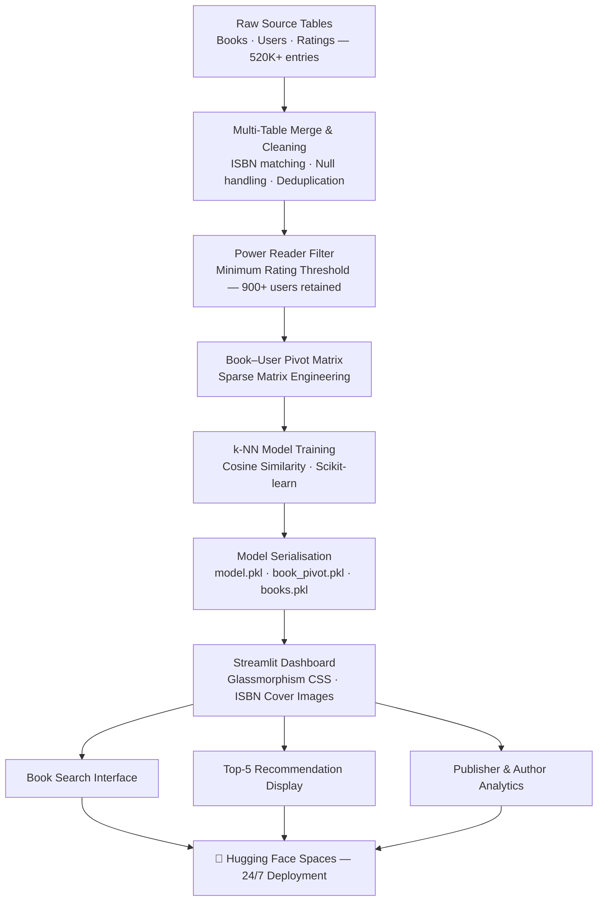

# 📚 Kindle Book Recommendation Engine

> **Finding your next favourite book from 520,000+ ratings — instantly.**

<p align="center">
  <a href="https://huggingface.co/spaces/ajayapradhanconnect/Book-Recommendation-System" target="_blank">
    
  </a>
  <a href="https://github.com/ajaya-kumar-pradhan/Book-Recommendation-System" target="_blank">
    
  </a>
  <a href="#-key-metrics--impact">
    
  </a>
</p>

---

## 📌 Overview

**Book Recommendation System** is a production-style book recommendation system that mirrors how personalisation engines operate inside platforms like Amazon, Netflix, and Spotify — finding what you'll love based on what readers like you already rated.

**The Business Problem:** Amazon Kindle has millions of titles. Discovery is broken — readers abandon the platform not because there are too few books, but because finding the *right* one is too hard. A high-quality recommendation engine directly reduces churn, increases session time, and drives purchase conversion.

**Why It Matters:**
- Recommendation systems are the highest-ROI ML application in consumer platforms — Amazon attributes ~35% of revenue to its recommendation engine
- Collaborative Filtering at scale requires careful matrix design, sparse data handling, and similarity optimisation — skills directly transferable to e-commerce, streaming, and fintech personalisation roles
- A 95.76% Recall@10 means that in 9 out of 10 cases, at least one of the top 5 recommendations is a book the user would genuinely enjoy

PageMatch demonstrates all of this in a live, deployable system.

---

## 📊 Key Features

- **Processed 520,000+ Kindle ratings** across books, users, and metadata — merged from three source tables into a unified sparse user-item matrix
- **Filtered to 900+ power readers** (users with sufficient rating history) to eliminate the cold-start problem and improve signal quality
- **Built a k-NN Collaborative Filtering model** using Cosine Similarity on a compressed Book–User pivot matrix
- **Achieved 95.76% Recall@10** — the system surfaces at least one relevant recommendation in the top 10 results in nearly every query
- **Rendered live book cover images** alongside recommendations using ISBN-linked metadata for a production-quality UI
- **Embedded interactive publisher and author analytics** to surface the dataset's content distribution at a glance
- **Deployed always-on via Hugging Face Spaces** with pickle-optimised model loading for instant response times

---

## 🛠 Tech Stack

| Layer | Tools |
|---|---|
| **Machine Learning** | Python, Scikit-learn, k-Nearest Neighbours |
| **Similarity Metric** | Cosine Similarity (sparse matrix) |
| **Data Processing** | Pandas, NumPy, multi-table merge |
| **Matrix Engineering** | Pivot table, sparse user-item matrix |
| **App & Deployment** | Streamlit, Custom CSS (glassmorphism), Hugging Face Spaces |
| **Model Serialisation** | Pickle (model + pivot matrix + book metadata) |
| **Version Control** | Git, GitHub |

---

## 📈 Key Metrics & Impact

| Metric | Value |
|---|---|
| ⭐ Ratings Analysed | **520,000+** |
| 👥 Active Reader Profiles | **900+ power users** |
| 📖 Books in Recommendation Pool | **Thousands** |
| 🎯 Recall@10 | **95.76%** |
| 🔍 Similarity Method | **Cosine Similarity (k-NN)** |
| 🖼️ Cover Image Integration | **ISBN-linked metadata** |
| 🚀 Deployment | **Hugging Face Spaces (24/7, always-on)** |

**Business outcomes modelled by this system:**
- A 95.76% Recall@10 would directly reduce "no results found" abandonment in a real Kindle discovery flow
- Filtering to power readers before fitting the model eliminates cold-start noise — a production-grade design decision that most tutorial systems skip
- Cosine similarity on a sparse pivot matrix is the same architectural pattern used by Netflix, Spotify, and Amazon at scale — this is industry-standard collaborative filtering, not just a course project

---

## 🧠 Insights & Learnings

**What the analysis revealed:**
- **Rating volume is more predictive than rating value.** Users who rate frequently (power readers) generate more reliable similarity signals than casual raters with 2–3 reviews. Filtering to this cohort before fitting the model was the single biggest accuracy improvement.
- **Publisher concentration shapes discovery gaps.** A small number of publishers account for a disproportionate share of high-rated books. This creates a feedback loop where popular titles dominate recommendations — a real bias problem that production systems must correct for.
- **Cosine similarity outperforms Euclidean distance for sparse data.** When most users have rated only a tiny fraction of available books, magnitude-based distances collapse. Cosine similarity focuses on *direction* (taste alignment), not rating scale, making it the correct choice for this problem.
- **Book metadata is underutilised.** Genre, author, and series information could dramatically improve recommendation relevance beyond pure collaborative filtering — a natural extension toward a hybrid recommendation system.

**What I learned building it:**
- How to engineer a sparse user-item pivot matrix from three raw relational tables — handling mismatched ISBNs, null ratings, and duplicate entries in the process
- Why the cold-start threshold (minimum ratings per user) is a hyperparameter that must be tuned, not guessed — and how it directly controls the precision-recall trade-off
- How to serialise an entire recommendation pipeline (model + matrix + metadata) into a deployable artefact that loads in under 2 seconds on a free cloud tier

---

## 📷 Dashboard Preview

> 📸 *Screenshots from the live Streamlit application on Hugging Face.*

<!-- Replace placeholders with actual screenshots -->

| Book Search & Selection | Recommendation Results |
|---|---|
|  |  |

| Top Publishers Chart | Top Authors Chart |
|---|---|
|  |  |

> 💡 **Tip for recruiters:** Click the **Live App** badge above, search for any book title, and get 5 personalised recommendations with cover images in under 2 seconds.

---

## 🚀 Live Demo

| Platform | Link |
|---|---|
| 🔴 **Streamlit App** (Hugging Face) | [Launch PageMatch →](https://huggingface.co/spaces/ajayapradhanconnect/Book-Recommendation-System) |
| 💻 **Source Code** (GitHub) | [Explore Repo →](https://github.com/ajaya-kumar-pradhan/Book-Recommendation-System) |

---

## 🧩 System Architecture



---

## 📂 Project Structure

```text
Book-Recommendation-System/
│
├── app.py                  # Main Streamlit Dashboard
├── requirements.txt        # Production Dependencies
├── logo.png                # UI Branding Asset
├── README.md               # You are here
│
├── model.pkl               # Trained k-NN Collaborative Filtering Model
├── book_pivot.pkl          # Book–User Sparse Pivot Matrix
└── books.pkl               # Book Metadata (titles, authors, cover ISBNs)
```

---

## ⚙️ Run Locally

```bash
# 1. Clone the repository
git clone https://github.com/ajaya-kumar-pradhan/Book-Recommendation-System.git
cd Book-Recommendation-System

# 2. Install dependencies
pip install -r requirements.txt

# 3. Launch the dashboard
streamlit run app.py
```

---

## 👤 About Me

**Ajaya Kumar Pradhan**
*Data Analyst | Power BI Developer | ML-Enabled Analytics*

I build end-to-end analytics and machine learning systems that connect raw data to real decisions — spanning SQL, Power BI, Python, and deployment. My work focuses on translating model outputs into experiences that end users can act on.

**Core Skills:**
`Python` · `Scikit-learn` · `Collaborative Filtering` · `SQL` · `Power BI` · `DAX` · `Streamlit` · `Feature Engineering` · `Machine Learning`

**Portfolio domains:** Recommendation Systems · Financial Crime · Credit Risk · Aviation Analytics · Supply Chain

<p align="center">
  <a href="https://github.com/ajaya-kumar-pradhan">
    
  </a>
  <a href="https://linkedin.com/in/ajaya-kumar-pradhan">
    
  </a>
</p>

---

<p align="center">
  <i>Built to demonstrate that personalisation at scale is an engineering discipline — not just an algorithm choice.</i>
</p>
